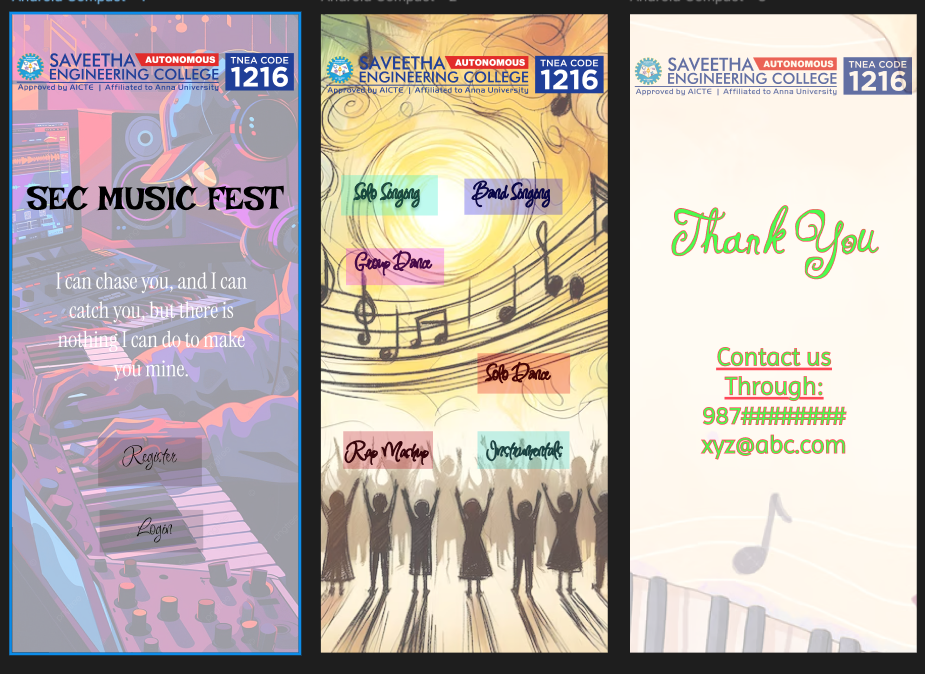

# Ex09 Event Registration Web Application
## Date:

## AIM:
To design, develop and deploy a web application for event registration.

## DESIGN STEPS:

### Step 1:
Create a new frame.

### Step 2:
Select any one preset size of your choice.

### Step 3:
Select the shapes you need.

### Step 4:
Import images as needed.

### Step 5:
Create pages based on your need and link them.

### Step 6:

Validate the HTML and CSS code.

### Step 6:

Publish the website in the given URL.

## DESIGN TOOL:
Figma

## CODE:

### Page 1
```
<!DOCTYPE html>
<html lang="en">
<head>
  <meta charset="UTF-8">
  <title>SEC Music Fest</title>
  <link rel="stylesheet" href="style.css">
</head>
<body>
  <div class="left-panel">
    <h1>SEC MUSIC FEST</h1>
    <p class="quote">
      I can chase you, and I can catch you, but there is nothing I can do to make you mine.
    </p>
    <div class="buttons">
      <a href="#" class="btn register">Register</a>
      <a href="#" class="btn login">Login</a>
    </div>
  </div>
</body>
</html>

body {
  margin: 0;
  font-family: 'Georgia', serif;
  background: linear-gradient(135deg, #3a1c71, #d76d77, #ffaf7b);
  height: 100vh;
  display: flex;
  justify-content: center;
  align-items: center;
}

.left-panel {
  background: rgba(255, 255, 255, 0.1);
  padding: 40px;
  border-radius: 12px;
  text-align: center;
  color: #fff;
  width: 400px;
  box-shadow: 0 8px 20px rgba(0,0,0,0.4);
}

.left-panel h1 {
  font-size: 2.2em;
  margin-bottom: 20px;
  letter-spacing: 2px;
  text-transform: uppercase;
}

.quote {
  font-style: italic;
  margin-bottom: 30px;
  line-height: 1.5;
}

.buttons {
  display: flex;
  justify-content: center;
  gap: 20px;
}

.btn {
  text-decoration: none;
  padding: 12px 24px;
  border-radius: 6px;
  font-weight: bold;
  transition: 0.3s ease;
}

.register {
  background: #ffaf7b;
  color: #000;
}

.login {
  background: #3a1c71;
  color: #fff;
}

.btn:hover {
  transform: scale(1.05);
  box-shadow: 0 4px 12px rgba(0,0,0,0.3);
}

```

### Page 2
```
<!DOCTYPE html>
<html lang="en">
<head>
  <meta charset="UTF-8">
  <title>SEC Music Fest Events</title>
  <link rel="stylesheet" href="style.css">
</head>
<body>
  <div class="middle-panel">
    <h1>Event Categories</h1>
    <ul class="event-list">
      <li>Solo Singing</li>
      <li>Band Singing</li>
      <li>Group Dance</li>
      <li>Solo Dance</li>
      <li>Rap Mashup</li>
      <li>Instrumentals</li>
    </ul>
  </div>
</body>
</html>


body {
  margin: 0;
  font-family: 'Trebuchet MS', sans-serif;
  background: linear-gradient(135deg, #ff6a00, #ee0979);
  height: 100vh;
  display: flex;
  justify-content: center;
  align-items: center;
}

.middle-panel {
  background: rgba(255, 255, 255, 0.15);
  padding: 40px;
  border-radius: 12px;
  text-align: center;
  color: #fff;
  width: 450px;
  box-shadow: 0 8px 20px rgba(0,0,0,0.4);
}

.middle-panel h1 {
  font-size: 2.4em;
  margin-bottom: 25px;
  text-transform: uppercase;
  letter-spacing: 2px;
}

.event-list {
  list-style: none;
  padding: 0;
  margin: 0;
}

.event-list li {
  background: rgba(255,255,255,0.2);
  margin: 10px 0;
  padding: 12px;
  border-radius: 8px;
  font-size: 1.2em;
  transition: 0.3s ease;
}

.event-list li:hover {
  background: rgba(255,255,255,0.4);
  transform: scale(1.05);
}

```

### Page 3
```
<!DOCTYPE html>
<html lang="en">
<head>
  <meta charset="UTF-8">
  <title>SEC Music Fest Contact</title>
  <link rel="stylesheet" href="style.css">
</head>
<body>
  <div class="right-panel">
    <h1>Thank You</h1>
    <p class="contact-text">Contact us Through:</p>
    <p class="contact-info">987##########</p>
    <p class="contact-info">xyz@abc.com</p>
  </div>
</body>
</html>


body {
  margin: 0;
  font-family: 'Verdana', sans-serif;
  background: linear-gradient(135deg, #00c6ff, #0072ff);
  height: 100vh;
  display: flex;
  justify-content: center;
  align-items: center;
}

.right-panel {
  background: rgba(255, 255, 255, 0.2);
  padding: 40px;
  border-radius: 12px;
  text-align: center;
  color: #fff;
  width: 400px;
  box-shadow: 0 8px 20px rgba(0,0,0,0.4);
}

.right-panel h1 {
  font-size: 2.4em;
  margin-bottom: 20px;
  text-transform: uppercase;
  letter-spacing: 2px;
}

.contact-text {
  font-size: 1.2em;
  margin-bottom: 15px;
}

.contact-info {
  font-size: 1.1em;
  margin: 8px 0;
  background: rgba(255,255,255,0.25);
  padding: 10px;
  border-radius: 6px;
}

```

## OUTPUT:



## RESULT:
The program to design, develop and deploy a web application for event registration is completed successfully.
